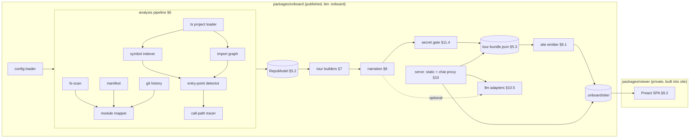
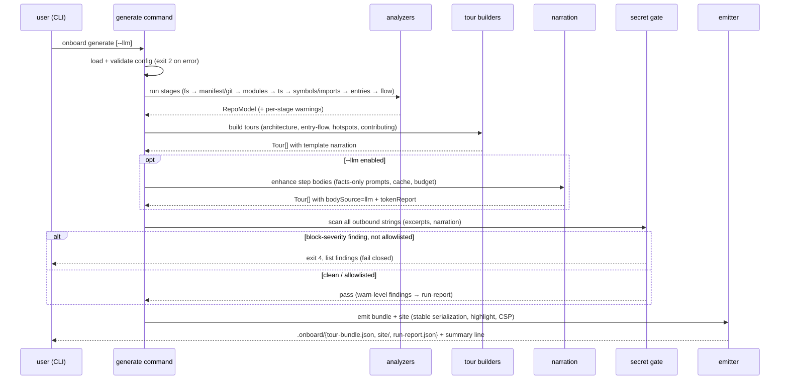
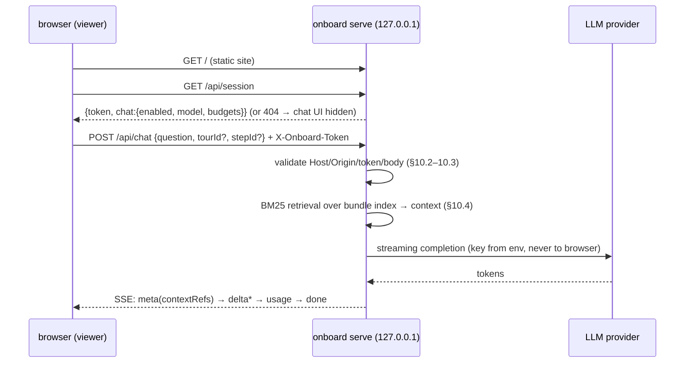
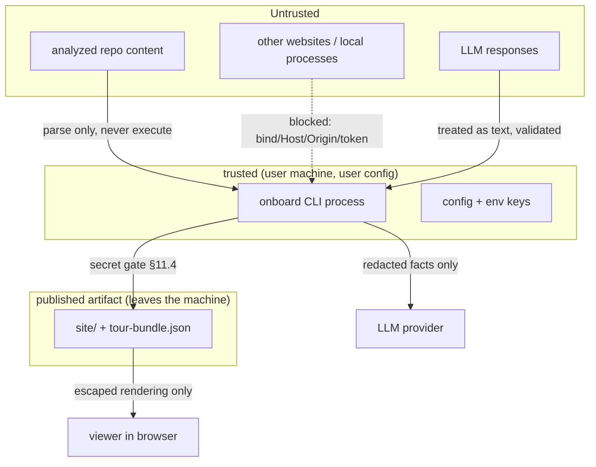

# onboard — v1 Design

Status: Draft for review (2026-07-10)
Owners: Fable (design), implementation delegated to low-capability agents via docs/issues/
Canonical: this file. GitHub Issues and PRs are derived artifacts.

---

## 1. Product Definition

### 1.1 One-liner

**onboard** generates an interactive, self-contained web tour of any codebase — deterministically, from static analysis, with an optional token-metered LLM layer.

### 1.2 Differentiation thesis

Any coding agent can "explain a codebase" if you let it burn tokens. onboard only deserves to exist if it beats that baseline on at least one of two axes, per product decision:

| Axis | onboard v1 claim | How it is made measurable |
|---|---|---|
| **Determinism** | With LLM disabled (the default), the same repo state + config + onboard version produces **byte-identical output** on any machine. No API key, no network, CI-safe. | Golden-file CI test (§14.4). Determinism contract (§5.6). |
| **Token efficiency** | When the LLM layer is enabled, it receives only pre-digested skeletons (facts + excerpts), never the raw repo. Consumption is capped, cached, and reported. | `tokenReport` in every bundle (§8.5): actual tokens vs. naive full-repo-dump baseline estimate. Chat shows per-answer and per-session token use (§10.7). |

Everything in this design must preserve these two properties. A feature that silently breaks determinism (in LLM-off mode) or hides token consumption is a design regression.

### 1.3 Target users and core scenarios

Primary: **human developers joining a codebase** (new hires, OSS first-time contributors, returning maintainers). Secondary: **AI agents**, which consume the same machine-readable tour bundle as cheap onboarding context.

1. **S1 — New teammate, local**: `npx onboard serve` in a cloned repo → browser opens a guided tour (architecture → main flow → hotspots → how to contribute), with Q&A chat answering from the generated index.
2. **S2 — OSS maintainer, published**: maintainer runs `onboard generate` in CI or locally, publishes `.onboard/site/` to GitHub Pages. Visitors take the tour; chat is automatically disabled (static hosting, no key exposure).
3. **S3 — Agent onboarding**: an agent reads `.onboard/tour-bundle.json` (a few hundred KB of structured facts) instead of exploring the repo ad hoc, saving the bulk of exploration tokens.

### 1.4 v1 scope summary

In scope (v1):
- CLI: `generate`, `serve`, `init` (§4).
- Deterministic analysis: filesystem, manifests, git history, module map, TS/JS deep analysis (symbols, imports, entry points, call paths) (§6).
- Four generated tours: Architecture, Entry-point Flow, Hotspots, Contributing (§7).
- Narration: deterministic templates (en/ja); optional LLM enhancement with budget, cache, fallback (§8).
- Self-contained static viewer (works from `file://`, local server, or GitHub Pages) (§9).
- `onboard serve`: local static server + chat proxy (localhost-only; API keys never reach the browser) (§10).
- Security: secret-leak gate before emit, XSS-safe rendering, hardened local server, no telemetry (§11).

Out of scope for v1: see §15 (non-goals, v2 deferrals, known unknowns).

---

## 2. System Overview

### 2.1 Components



### 2.2 Generate pipeline (sequence)



### 2.3 Serve + chat (sequence)



### 2.4 Repository layout (this repo, target state)

```
onboard/
├── package.json                # private workspace root ("type": "module")
├── pnpm-workspace.yaml         # packages/*
├── packages/
│   ├── onboard/                # published package (name: KU-1, bin: "onboard")
│   │   ├── package.json
│   │   ├── src/
│   │   │   ├── cli/            # command wiring, flags, exit codes      (§4)
│   │   │   ├── config/         # schema, defaults, loader              (§4.3)
│   │   │   ├── model/          # RepoModel/TourBundle types + zod      (§5)
│   │   │   ├── analyze/
│   │   │   │   ├── fsscan/     # §6.2
│   │   │   │   ├── manifest/   # §6.3
│   │   │   │   ├── git/        # §6.4
│   │   │   │   ├── modules/    # §6.5
│   │   │   │   ├── ts/         # project loader §6.6
│   │   │   │   ├── symbols/    # §6.7
│   │   │   │   ├── imports/    # §6.8
│   │   │   │   ├── entries/    # §6.9
│   │   │   │   └── flow/       # §6.10
│   │   │   ├── tours/          # framework + 4 builders               (§7)
│   │   │   ├── narrate/        # templates en/ja + llm enhancer       (§8)
│   │   │   ├── secretscan/     # gate                                  (§11.4)
│   │   │   ├── searchindex/    # BM25 build                            (§10.4)
│   │   │   ├── emit/           # bundle + site emitters                (§9.1)
│   │   │   ├── server/         # serve command internals               (§10)
│   │   │   ├── llm/            # provider adapters (fetch-based)       (§10.5)
│   │   │   ├── chat/           # context assembly, SSE                 (§10.3–10.4)
│   │   │   └── util/           # stable-json, hashing, log, paths
│   │   ├── assets/viewer/      # built viewer output (gitignored; from packages/viewer)
│   │   └── test/               # unit + e2e + fixtures + helpers       (§14)
│   └── viewer/                 # private Preact SPA
│       ├── src/{app.tsx, router.ts, store.ts, i18n/, components/}
│       └── vite.config.ts      # IIFE single-bundle → ../onboard/assets/viewer
├── docs/                       # this design, ADRs, issues, research
└── .github/workflows/ci.yml
```

---

## 3. Technology Stack

Decisions recorded in ADRs; versions are the current majors verified on 2026-07-10 (pin exact versions in lockfile; runtime-output-affecting deps like Shiki are pinned exactly in package.json — see ADR-007).

| Concern | Choice | Version line | Rationale (ADR) |
|---|---|---|---|
| Language/runtime | TypeScript on Node.js ≥ 20, pure ESM | TS ^7.0 (fallback ~5.9 if toolchain friction: KU-2) | ADR-001 |
| Package manager / layout | pnpm workspaces: `packages/onboard` (published), `packages/viewer` (private) | pnpm ≥ 9 | ADR-001 |
| CLI framework | commander | ^15 | ADR-001 |
| Schema validation | zod | ^4 | ADR-001 |
| TS/JS analysis | ts-morph (bundles its own TS compiler — decoupled from our build TS) | ^28 | ADR-005 |
| Generic ignore handling | ignore | ^7 | §6.2 |
| Syntax highlighting | shiki (generate-time only; never in browser) | ^4 (exact-pinned) | ADR-004 |
| Markdown rendering | markdown-it, `{ html: false, linkify: false }` (emit-time) | ^14 | §11.5 |
| Static file serving | sirv | ^3 | §10.1 |
| Viewer | Preact SPA, hand-rolled hash router, IIFE single bundle via Vite | preact ^10, vite ^8 | ADR-004 |
| LLM providers | **No SDKs.** Hand-rolled `fetch` adapters: `anthropic`, `openai-compat` | — | ADR-003, §10.5 |
| Tests | vitest (unit/component), Playwright (viewer smoke) | vitest ^4 | §14 |
| Lint/format | eslint ^9 (typescript-eslint) + prettier ^3 | — | §14.6 |
| Dev runner (dev script only, never a runtime dep) | tsx | ^4 | ADR-001 |

Node engines: `>=20`. CI matrix: Node 22.x and 24.x (both LTS as of 2026-07).

---

## 4. CLI Contract

### 4.1 Commands

```
onboard generate [path]        # analyze repo at path (default ".") and emit tour
  --out <dir>                  # output dir (default: <repo>/.onboard)
  --config <file>              # config path (default: <repo>/onboard.config.json if present)
  --tours <list>               # comma-separated subset of: architecture,entry-flow,hotspots,contributing
  --entry <file[#symbol]>      # repeatable; overrides entry-point detection (§6.9)
  --llm                        # enable LLM narration (requires config.llm; else exit 2)
  --locale <en|ja>             # narration + viewer default locale (default: en)
  --no-git                     # skip git analyzer (hotspots tour becomes unavailable)
  --json                       # print machine-readable run report (run-report.json content) to stdout
  --quiet | --verbose          # log level
onboard serve [path]           # serve .onboard/site + chat proxy on 127.0.0.1
  --port <n>                   # default 4923; if busy, exit 2 (no auto-increment: deterministic)
  --open                       # open browser after start
  --fresh                      # force re-generate before serving
                               # if bundle missing: runs generate with defaults first (logged)
onboard init                   # write onboard.config.json (defaults, commented via $schema)
                               # + append ".onboard/" to .gitignore (idempotent, creates if absent)
onboard --version | --help
```

Notes:
- `[path]` must be a directory; all analysis is rooted there ("repo root"). Git is optional (§6.4).
- `serve` never writes to the repo except `.onboard/` when generating.
- No interactive prompts anywhere (agent- and CI-safe). Missing required input → exit 2 with actionable message.

### 4.2 Exit codes

| Code | Meaning | Examples |
|---|---|---|
| 0 | Success | generate/serve/init completed |
| 1 | Unexpected internal error | caught top-level exception; message + issue-report hint |
| 2 | Usage / config error | unknown flag, invalid config, `--llm` without `config.llm`, port busy |
| 3 | Analysis failure | path not a directory, zero analyzable files, ts-morph fatal on all candidates |
| 4 | Secret gate blocked emit | block-severity finding not allowlisted (§11.4) |

Warnings never change the exit code; they go to stderr and `run-report.json`.

### 4.3 Config file — `onboard.config.json`

Strict zod schema (unknown keys → exit 2 listing them). All fields optional; defaults below are normative.

```jsonc
{
  "$schema": "./node_modules/<pkg>/schemas/onboard.config.schema.json",
  "include": ["**/*"],
  "exclude": [],                        // globs, added to built-in exclusions (§6.2)
  "maxFiles": 20000,
  "maxFileSizeKB": 512,
  "tours": ["architecture", "entry-flow", "hotspots", "contributing"],
  "locale": "en",                       // "en" | "ja"
  "entryPoints": [                      // overrides detection when non-empty
    { "file": "src/index.ts", "symbol": "main", "kind": "bin" }
  ],
  "flow":     { "maxDepth": 4, "maxFanOut": 3, "maxEntries": 3 },
  "hotspots": { "maxFiles": 10, "halfLifeDays": 90 },
  "excerpt":  { "maxLines": 40, "contextLines": 3 },
  "llm": {                              // presence required for --llm / chat
    "provider": "anthropic",            // "anthropic" | "openai-compat"
    "model": "<model-id>",
    "baseUrl": null,                    // required for openai-compat; forbidden for anthropic
    "maxInputTokensPerStep": 800,
    "maxOutputTokensPerStep": 350,
    "maxTokensPerRun": 60000,
    "temperature": 0
  },
  "chat": {
    "enabled": true,                    // effective only under `onboard serve` with config.llm
    "maxTokensPerSession": 100000,
    "maxOutputTokensPerAnswer": 800,
    "topK": 8
  },
  "secretScan": { "allowlist": [] },    // per-finding ids (§11.4); there is NO global disable (ADR-006)
  "viewer": { "title": null }           // override site title (default: repo name)
}
```

**API keys never appear in config.** Keys come only from environment variables (§4.4). A config containing a key-like value in `llm` fails validation (scan values against §11.4 block rules).

### 4.4 Environment variables

| Var | Meaning |
|---|---|
| `ONBOARD_LLM_API_KEY` | Preferred key for the configured provider |
| `ANTHROPIC_API_KEY` | Fallback when provider = anthropic |
| `OPENAI_API_KEY` | Fallback when provider = openai-compat |
| `NO_COLOR` | Disable ANSI colors (also auto-disabled when stderr is not a TTY) |

onboard performs **no network I/O of any kind** unless `--llm` narration or serve-mode chat is explicitly configured — and then only to the configured provider endpoint. No telemetry, ever (§11.9).

### 4.5 Output layout

```
.onboard/
├── tour-bundle.json          # canonical machine-readable artifact (§5.3)
├── site/                     # self-contained static viewer (§9.1)
│   ├── index.html            # inline JSON data + CSP meta
│   ├── app.js                # IIFE bundle (classic script: works from file://)
│   └── app.css
├── cache/narration-cache.json  # LLM narration cache (§8.4); safe to delete
└── run-report.json           # timings, counts, warnings, tokenReport, warn-level findings
```

`onboard init` adds `.onboard/` to `.gitignore`. Publishing a tour = copying `site/` (e.g., to GitHub Pages); `tour-bundle.json` may be committed intentionally for agent consumption.

---

## 5. Data Model

All types live in `packages/onboard/src/model/` as TypeScript interfaces + zod schemas. zod is the runtime source of truth; interfaces are inferred (`z.infer`).

### 5.1 IDs, hashing, paths

- Hash = SHA-256 (node:crypto), lowercase hex. `short12(x)` = first 12 hex chars; `short8(x)` = first 8.
- All serialized paths are **repo-root-relative, POSIX-separated (`/`), NFC-normalized**. Absolute paths must never appear in any output artifact (privacy).
- `excerptId = "x" + short12(sha256(path + "\n" + startLine + "-" + endLine + "\n" + sha256(text)))`
- `entryId = "e" + short8(sha256(file + "#" + (symbol ?? "")))`
- `stepId = "<tourId>/<zero-padded 2-digit index>-<kebab slug of title, ascii, max 40 chars>"`
- Secret finding id: `"s" + short12(sha256(path + ":" + line + ":" + ruleId))`
- Tour ids: `architecture`, `entry-flow:<entryId>`, `hotspots`, `contributing`.

### 5.2 RepoModel (internal, produced by pipeline; not serialized into the bundle)

```ts
interface RepoModel {
  root: string;                      // absolute, in-memory only
  files: FileNode[];                 // sorted by path (byte order)
  languages: { lang: string; files: number; bytes: number }[];
  manifest: ManifestInfo | null;     // §6.3 (root package.json et al.)
  readme: { title: string | null; firstParagraph: string | null; badgeCount: number } | null;
                                     // §6.3 — separate from manifest so no-package.json repos keep it
  ciWorkflows: CiWorkflow[];
  docsFiles: { path: string; kind: "readme"|"contributing"|"license"|"codeofconduct" }[];
  git: GitStats | null;              // null when --no-git or not a repo
  ts: TsAnalysis | null;             // null when no TS/JS sources loadable
  symbols: SymbolRef[];              // §6.7; empty when ts == null
  imports: { edges: { from: string; to: string }[];
             externals: { pkg: string; importCount: number }[] };   // §6.8
  modules: ModuleInfo[];             // §6.5
  moduleEdges: { from: string; to: string; weight: number }[];      // §6.5 module-level aggregation (ids)
  entryPoints: EntryPoint[];         // §6.9
  callPaths: CallPath[];             // §6.10; empty when ts == null
  warnings: PipelineWarning[];
}

interface FileNode {
  path: string;                      // relative POSIX
  size: number;                      // bytes
  lang: string | null;               // from extension map (§6.2); null = unknown/binary
  lineCount: number | null;          // counted during the read pass; null when content was never read
  isTest: boolean;                   // path heuristics (§6.2)
  sha256: string;                    // "" (empty, documented sentinel) when content was never read (binary/oversized/minified)
}

interface GitStats {
  headCommit: string; dirty: boolean;
  headCommitterDateIso: string;      // UTC ISO-8601
  commitsAnalyzed: number;           // capped (§6.4)
  perFile: { path: string; commits: number; lastTouchedIso: string; contributorCount: number;
             commitDatesIso: string[] }[];   // committer dates, sorted desc, capped at 50 (§7.4 scoring input)
  cochange: { a: string; b: string; count: number; lift: number }[];
}

interface ModuleInfo {
  id: string;                        // "m" + short8(sha256(path))
  path: string;                      // directory, relative POSIX ("." for root)
  role: ModuleRole;                  // §6.5 taxonomy
  fileCount: number; loc: number;
  fanIn: number; fanOut: number;     // module-level import edges
  topSymbols: string[];              // ≤5 exported symbol names
  files: string[];                   // assigned file paths — in-memory only; STRIPPED from the bundle (§5.4)
}
type ModuleRole = "entry"|"http-api"|"ui"|"domain"|"data-access"|"infra"|"config"
                | "tests"|"docs"|"build"|"scripts"|"shared-utils"|"unknown";

interface EntryPoint {
  id: string; file: string; symbol: string | null;
  kind: "bin"|"server"|"web-app"|"lib";
  flowEligible: boolean;             // false = not traceable in v1 (e.g. framework configs, §6.9)
  evidence: string[];                // sanitized fixed labels + normalized paths only (§6.9)
  score: number;                     // §6.9 ranking
}

interface CallPath {
  entryId: string;
  hops: {
    caller: SymbolRef; callee: SymbolRef;
    callSite: Anchor;                // where caller invokes callee
    branchNotes: string[];           // names of skipped significant siblings (≤ maxFanOut-1)
  }[];
  truncated: boolean;                // hit maxDepth or unresolvable dispatch
}
interface SymbolRef { file: string; name: string; kind: string; startLine: number; endLine: number; signature: string; jsdocSummary: string | null; exported: boolean; }
interface Anchor { file: string; startLine: number; endLine: number; symbol?: string }
```

### 5.3 TourBundle (canonical output artifact)

```ts
interface TourBundle {
  schemaVersion: 1;
  meta: {
    onboardVersion: string;
    repoName: string;                // from manifest.name || basename(root)
    headCommit: string | null;
    generatedAt?: string;            // = git HEAD committer date (UTC ISO). OMITTED when dirty/no-git (§5.6)
    dirty: boolean;
    locale: "en" | "ja";
    configHash: string;              // sha256 of effective config (stable-serialized)
    tourAvailability: { kind: TourKind; available: boolean; reason: string | null;
                        reasonCode: string | null }[];   // stable codes, e.g. "no-git-flag" | "git-unavailable" | "no-ts" | "no-traceable-entries" | "too-few-steps"
    tokenReport: TokenReport | null; // null when LLM narration disabled
    stats: { files: number; loc: number; languages: { lang: string; files: number }[] };
  };
  tours: Tour[];
  index: ViewerIndex;
  excerpts: Record<string, CodeExcerpt>;   // key = excerptId
}

type TourKind = "architecture" | "entry-flow" | "hotspots" | "contributing";

interface Tour {
  id: string; kind: TourKind;
  title: string; summary: string;
  estimatedMinutes: number;          // ceil(steps × 1.5)
  steps: TourStep[];                 // linear; ≥ 2 steps or tour is dropped with availability reason
}

interface TourStep {
  id: string; title: string;
  body: string;                      // markdown (subset: no raw HTML), narration
  bodySource: "template" | "llm";
  anchor: Anchor | null;
  excerptId: string | null;
  widgets: StepWidget[];             // §5.5
}

interface CodeExcerpt {
  id: string; file: string; startLine: number; endLine: number;
  lang: string | null;
  text: string;                      // raw text, exact bytes decoded as UTF-8 (lossy for invalid)
}

interface TokenReport {
  model: string; provider: string;
  narration: { inputTokens: number; outputTokens: number; stepsEnhanced: number; stepsFromCache: number; stepsFallback: number };
  naiveBaselineEstimate: number;     // ceil(total analyzed text bytes / 4)
  savingsRatio: number;              // 1 - (input+output)/baseline, clamped ≥ 0
}
```

### 5.4 ViewerIndex (drives viewer navigation and chat retrieval)

```ts
interface ViewerIndex {
  files: { p: string; s: number; l: string | null }[];   // path, size, lang; sorted by p
  modules: Omit<ModuleInfo, "files">[];                   // §5.2 shape; the per-module file list is stripped (size)
  symbols: { file: string; name: string; kind: string; line: number; signature: string }[]; // exported only, sorted (file, line)
  search: Bm25Index;                                      // §10.4
}
```

### 5.5 Step widgets (precomputed layout: viewer only renders)

```ts
type StepWidget =
  | { type: "module-map"; treemap: { id: string; name: string; role: ModuleRole; loc: number;
        x: number; y: number; w: number; h: number }[];      // 0..1000 coordinate space, strip-treemap (§7.2)
      focus: string[] }                                       // module ids to highlight
  | { type: "dep-graph"; nodes: { id: string; label: string; role: ModuleRole; x: number; y: number }[];
      edges: { from: string; to: string; weight: number }[] } // layered layout (§7.2), x = depth*220, y = slot*90
  | { type: "file-list"; items: { path: string; note: string }[] };
```

Layouts are computed at generate time with deterministic algorithms so the viewer stays dumb and rendering is reproducible.

### 5.6 Determinism contract and stable serialization

**Contract:** for a given (repo worktree content, effective config, onboard version, locale), with LLM narration disabled, `tour-bundle.json` and every file under `site/` are **byte-identical** across runs and machines (macOS/Linux).

Normative rules (enforced by `util/stable-json.ts` and review):
1. JSON serialization: recursively key-sorted, 2-space indent, `\n` line endings, trailing newline, every `<` escaped as `\u003c` (XSS-safe embedding, §11.5).
2. Every array in output has a documented explicit sort (paths: byte order; symbols: (file, startLine); tours: fixed kind order architecture → entry-flow → hotspots → contributing; entry-flow tours by entryId). "Byte order" is defined once, repo-wide: lexicographic comparison of the strings' UTF-8 byte sequences (implemented by one shared comparator in `util/`; note this differs from JS default UTF-16 ordering for some non-ASCII strings).
3. Forbidden in generate/emit code paths: `Date.now()`, `new Date()` without argument, `Math.random()`, iteration over unsorted `Map`/`Set`/object keys into output, absolute paths, environment-dependent strings (hostname, username, locale-dependent formatting; always use `en-US`-invariant formatting helpers).
4. `meta.generatedAt` = HEAD **committer date** (deterministic per commit). When the worktree is dirty or git is absent: field omitted, `meta.dirty: true`.
5. Parallelism allowed only if results are collected then sorted before serialization.
6. LLM narration is inherently non-deterministic → determinism contract applies to LLM-off mode; with LLM on, the narration cache (§8.4) makes re-runs stable until cache invalidation. `bodySource` marks provenance per step.
7. Dependency pinning: deps whose output feeds artifacts (shiki, markdown-it, ts-morph) are pinned exact in package.json (ADR-007).

CI enforces the contract by running generate twice on a fixture and diffing hashes (§14.4).

### 5.7 Schema versioning

`schemaVersion: 1`. Any breaking change to TourBundle bumps it; the viewer refuses to load a bundle with a higher major schemaVersion than it knows (clear error screen). Additive optional fields do not bump the version.

---

## 6. Analysis Pipeline

### 6.1 Orchestration and stage contract

`analyze/pipeline.ts` runs stages in fixed order with explicit data dependencies (§2.1 graph). Every stage:
- is a pure function `(input, config, logger) → output | StageSkip` — no global state;
- must not throw for *content* reasons: malformed files produce warnings + degraded output, never a crash;
- may throw `StageFatal` only for environment reasons (unreadable root, out-of-memory guard);
- appends `PipelineWarning { stage, code, message, path? }` to the model.

Graceful degradation matrix (drives `meta.tourAvailability`):

| Condition | Effect |
|---|---|
| Not a git repo / `--no-git` | `git = null`; hotspots tour unavailable (`reason: "requires git history"`); architecture module ranking falls back to size+centrality |
| No TS/JS sources | `ts = null`; entry-flow tour unavailable (`reason: "requires TS/JS analysis in v1"`) |
| TS present but zero flow-eligible call paths (no entries detected, or all paths < 2 hops) | entry-flow tour unavailable (`reason: "no traceable entry points"`) |
| No package.json | contributing tour degrades to generic steps (README/CI only); never unavailable |
| < 5 analyzable files | generate succeeds; warning `pipeline-tiny-repo`; the architecture tour is the only *guaranteed* tour — the others still appear when their own conditions hold |
| tsconfig unparsable | synthesize default program (§6.6) + warning |

### 6.2 fs-scan (`analyze/fsscan/`)

Input: repo root. Output: `FileNode[]`, `languages`, `docsFiles`.

1. File listing: if git repo → `git ls-files --cached --others --exclude-standard -z` (respects .gitignore exactly, includes untracked); else manual walk applying `.gitignore` files via `ignore` package.
2. Built-in excluded directories (always, in addition to gitignore): `node_modules .git .hg .svn dist build out coverage .next .nuxt .svelte-kit .turbo .cache vendor target __pycache__ .venv venv .onboard`.
3. **Sensitive-file exclusion (never read, never listed in output):** basename matches `.env` / `.env.*` / `*.pem` / `*.key` / `*.p12` / `*.pfx` / `*.keystore` / `*.jks` / `id_rsa*` / `id_ed25519*` / `.npmrc` / `.netrc` / `*.tfstate`; or basename contains `secret`/`credential` **and** extension ∈ {json,yml,yaml,env,txt,ini,cfg,properties} (code files like `secretScanner.ts` stay in).
4. Symlinks: `lstat` everything; symlinks are recorded as warnings and **never followed** (neither inside nor outside root).
5. Binary detection: extension denylist (images/fonts/archives/media/executables/wasm/lockb) → `lang: null`, content never read; else read first 8KB, NUL byte ⇒ binary.
6. Caps: file > `maxFileSizeKB` → listed but content never read (`lang` kept, warning); file count > `maxFiles` → stop after cap (sorted order guarantees determinism), warning with counts. Minified heuristic: single line > 5000 chars ⇒ treat as binary-like (no excerpts).
7. Language map: single table `ext → lang` (~35 entries: ts tsx mts cts js jsx mjs cjs json jsonc md py go rs rb java kt swift c h cpp hpp cs php sh bash zsh sql yaml yml toml html css scss less vue svelte proto graphql tf). `isTest`: path contains `/__tests__/`, `/test/`, `/tests/`, or basename matches `*.test.*` / `*.spec.*` / `*_test.go` / `test_*.py`.
8. Output sorted by path byte order. Hash each read file (sha256).

### 6.3 Manifest analyzer (`analyze/manifest/`)

- Root `package.json`: `name, version, description, bin, main, exports, scripts (dev/start/build/test/lint), engines.node, workspaces, dependency names` (names only — versions irrelevant to tours), package manager from lockfile (`pnpm-lock.yaml` → pnpm, `yarn.lock` → yarn, `bun.lockb` → bun, `package-lock.json` → npm).
- Framework/runner detection from dependency names table: next/nuxt/astro/vite/express/fastify/koa/nest/react/vue/svelte; vitest/jest/mocha/node:test; eslint/biome/prettier.
- Other ecosystems shallow (name + kind only): `pyproject.toml`, `go.mod`, `Cargo.toml`, `Gemfile`, `pom.xml` → recorded so narration can say "also contains a Go module".
- Node version from `engines.node` / `.nvmrc` / `.tool-versions`.
- README: title (first `# h1`), first paragraph (plain text, ≤ 400 chars), badge count — stored on `RepoModel.readme`, independent of package.json presence. CONTRIBUTING/LICENSE/CODE_OF_CONDUCT presence comes from fs-scan `docsFiles` (§6.2), not re-detected here.
- CI: `.github/workflows/*.yml` and `*.yaml` → name + `on:` triggers (scalar, list, and map forms) + job names (heuristic line-based extraction; on failure record filename only + warning).

### 6.4 Git history analyzer (`analyze/git/`)

- Preconditions: `.git` exists and `git` binary available; else `git = null` + warning.
- Command: `git -c core.quotepath=false -c core.fsmonitor=false -c core.hooksPath=/dev/null --no-pager log --no-merges --name-only --format=%H%x00%cI%x00%aE -n 5000 -- .` executed with `cwd = root`, env `GIT_TERMINAL_PROMPT=0` (cap 5000 commits; note in warnings when capped; the analyzed repo is untrusted input — no prompts, hooks, pagers, or fsmonitor may run: §11.2 T1). Shallow clone: works with whatever is available; record `commitsAnalyzed`.
- Per file (only files present in current FileNode set): commit count, last touched date, committer dates (`commitDatesIso`, UTC, sorted desc, capped at 50 per file — hotspot scoring input §7.4), distinct author-email **count** (emails are hashed then discarded — identities never stored: §11.9).
- Co-change: for commits touching ≤ 20 files, count unordered pairs; keep pairs with `count ≥ 4` and `lift > 2.0` where `lift = P(a∧b) / (P(a)·P(b))` over analyzed commits; cap output at 200 pairs by count desc, tie-break lexicographic.
- `headCommit`, `dirty` (`git status --porcelain` non-empty), `headCommitterDateIso`.

### 6.5 Module mapper (`analyze/modules/`)

Purpose: fold files into ≤ ~30 human-meaningful "modules" (directories).

1. Candidate module roots: depth-1 and depth-2 directories under root and under `src/` (plus workspace package roots when manifest.workspaces present).
2. Fold rule: a candidate with < 3 files merges into its parent; nested candidates both kept only if child has ≥ 8 files.
3. Role classification: first match wins, by (a) exact/major dir-name table (`routes|api|controllers → http-api`, `components|pages|views|ui → ui`, `models|domain|core|services → domain`, `db|repositories|dao|prisma|migrations → data-access`, `infra|adapters|clients|queue → infra`, `config|settings → config`, `test|tests|__tests__|e2e → tests`, `docs|documentation → docs`, `scripts|tools|bin → scripts`, `util|utils|lib|shared|common → shared-utils`, `build|ci → build`), then (b) contains an entry point → `entry`, then (c) `unknown`.
4. Metrics: fileCount, loc (sum of read files' line counts), module-level fanIn/fanOut from file import edges (§6.8) aggregated, topSymbols = up to 5 exported symbols by fan-in of their file. The mapper also emits `RepoModel.moduleEdges` (`{ from: moduleId, to: moduleId, weight: file-edge count }`, deduped, sorted (from, to)) — the dep-graph input (§7.2).

### 6.6 TS project loader (`analyze/ts/`)

- Discover `tsconfig.json` (root, then `src/`); when multiple (workspaces), load root-most; record which.
- No tsconfig: synthesize in-memory project `{ allowJs: true, checkJs: false, module: NodeNext, target: ES2022, jsx: react-jsx }` and add all `ts|tsx|js|jsx|mjs|cjs` FileNodes.
- Guards: skip loader entirely (with warning) when TS/JS-family file count > 8000 or estimated source bytes > 128 MB (KU-3). ts-morph is used **parse/type-check only — target code is never imported or executed** (§11 T1).
- Output `TsAnalysis { project, sourceFileCount, tsconfigPath | null }` (in-memory only).

### 6.7 Symbol indexer (`analyze/symbols/`)

For each source file: exported declarations only (functions, classes, consts of function/arrow type, enums, interfaces, type aliases). Produce `SymbolRef` (§5.2): one-line signature via ts-morph (`getText()` of signature-relevant part, collapsed whitespace, ≤ 120 chars + `…`), `jsdocSummary` = first sentence of JSDoc description ≤ 200 chars. Sorted (file, startLine). Cap: 40 symbols/file with warning.

### 6.8 Import graph (`analyze/imports/`)

- TS path: per source file, resolved module specifiers (static `import`/`export from`, plus `require("literal")` and `import("literal")` with string-literal arguments) → in-repo file targets via compiler resolution. External imports recorded as package-name counts (for narration: "uses express, zod").
- Non-TS fallback (v1 minimal): none — non-TS files get no import edges; module fanIn/fanOut simply reflect TS/JS.
- Dynamic `import(expr)` with non-literal `expr`: count + warning; not an edge.
- Output: `edges: { from, to }[]` (file-level, deduped, sorted), aggregated to module level in §6.5.

### 6.9 Entry-point detector (`analyze/entries/`)

Candidate sources → evidence strings (each adds score):
| Signal | Kind | Score |
|---|---|---|
| `package.json` `bin` entries | bin | +50 |
| `main`/`exports` resolution target | lib | +30 |
| `scripts.start`/`scripts.dev` parsed file argument (node/tsx/ts-node) | server | +25 |
| File calls `*.listen(` / `serve(` / `createServer(` (symbol scan) | server | +20 |
| Framework markers (next/nuxt/astro configs) | web-app | +20 (file = config; flow tour skips: framework-internal) |
| Filename `src/index.*`, `src/main.*`, `server.*`, `cli.*` | (keep kind from other evidence, else lib) | +10 |
| CLI framework usage (commander/yargs import + `.parse(`) | bin | +15 |

Config `entryPoints` non-empty → detection skipped entirely (kind/symbol taken from config; file must exist or exit 2). Dedupe by file; rank by score desc, tie-break path lexicographic; keep top `flow.maxEntries` (default 3). `symbol` = exported function called at top level of the file when identifiable, else null (flow starts at file top-level statements).

### 6.10 Call-path tracer (`analyze/flow/`)

Two sub-stages (two issues): **resolution** and **selection**.

Resolution (per entry point): starting node = entry symbol's body (or file top-level statements). Enumerate call expressions in order; resolve each callee via ts-morph type checker to an **in-repo** declaration. Resolvable: direct calls, imported functions, static methods, `new Class()` → constructor, instance methods when receiver type is a project class. Unresolvable (recorded, skipped): dynamic dispatch through interfaces with >1 project implementation, callbacks into externals, `any`.

Selection: greedy DFS chain, depth ≤ `flow.maxDepth`. At each level score callees: `+3` same-module, `+3` exported, `+2` body ≥ 5 statements, `+2` name not in denylist (`log debug warn error assert format parse stringify get set has`), `+1` fan-out ≥ 2. Highest score becomes the next hop (tie → source order); up to `maxFanOut - 1` named siblings become `branchNotes`. Stop at depth, external boundary, recursion (visited set), or no significant callee. Result: one linear `CallPath` per entry (≥ 2 hops required, else entry dropped from flow tour with warning).

---

## 7. Tour Generation

### 7.1 Tour builder contract (`tours/`)

`buildTour(model: RepoModel, config, strings: StringTable) → Tour | TourUnavailable { kind, reason }`.
Builders are pure; they read RepoModel only. Steps get **template narration** here (§8.1); LLM enhancement is a later pass. Excerpt extraction goes through one shared service:

**Excerpt service** (`tours/excerpts.ts`): `takeExcerpt(file, startLine, endLine)` clamps to `excerpt.maxLines` (default 40), expands ±`contextLines` for call sites, skips leading license-comment block for file-head excerpts, decodes UTF-8 (lossy), registers into the bundle-wide dedup map by excerptId.

### 7.2 Architecture tour (`kind: architecture`, always available)

Steps:
1. **Welcome** — repo name, README first paragraph, stats (files, loc, top languages), tour index.
2. **Repo map** — `module-map` widget. Treemap layout: strip algorithm — modules sorted by loc desc, rows of ≤ 4, coordinate space 0..1000×1000, row height ∝ row loc share; deterministic (sorted input, integer rounding via `Math.round`).
3. **Top modules** — one step per module, top N = min(8, modules with role ∉ {tests, docs, build}) ranked by `0.3·norm(fileCount) + 0.3·norm(loc) + 0.4·norm(fanIn)`; each step: role, metrics, key exports, representative excerpt = highest-fan-in exported symbol's declaration.
4. **Dependencies** — present only when ≥ 1 module edge exists (docs-only repos omit this step): `dep-graph` widget (module nodes; layered by topological depth of the module import DAG; deterministic cycle handling: iterate edges by weight desc, tie (from, to) asc, keep an edge only if it does not create a cycle — skipped edges are noted in the step facts; x = depth·220, y = slot·90 sorted by module id) + narration of the 3 heaviest edges (weight desc, tie (from, to) asc).
5. **Where next** — pointers to the other available tours (uses `tourAvailability`).

### 7.3 Entry-point flow tour (`kind: entry-flow`, one tour per entry, requires ts + callPaths)

Per entry (≤ `flow.maxEntries`): step 0 = entry overview (kind, evidence list, file-head excerpt); steps 1..H = one per hop — title `"{caller} → {callee}"`, call-site excerpt (±contextLines) plus callee declaration head, branchNotes rendered as "also branches to: …"; final step = flow recap (breadcrumb of hops) + truncation note when `truncated`.

### 7.4 Hotspots tour (`kind: hotspots`, requires git)

Score per file: `Σ over commits touching file: exp(−ln2 · ageDays / halfLifeDays)` (default half-life 90 days). Exclude: `isTest`, `lang == null`, lockfiles, generated dirs already excluded. Steps: intro (method explanation honesty: "frequency ≠ importance, but correlates"), one step per top `hotspots.maxFiles` (default 10) — excerpt = file head or top symbol, narration includes commit count, last touched, and co-change notes ("usually changes together with `x/y.ts` (7 shared commits)"), closing step.

### 7.5 Contributing tour (`kind: contributing`, always available, degrades)

Steps (skip any with no data, min 2 = welcome + repo docs):
1. Welcome & prerequisites (package manager, node version).
2. Setup (`<pm> install`; workspace note when workspaces present).
3. Run & test (scripts table; **"run a single test"** instructions from runner table: vitest `pnpm vitest run path/to.test.ts`, jest `npx jest path`, go `go test ./pkg/...`, pytest `pytest path::test`).
4. Lint/format tooling summary.
5. CI overview (workflow names + triggers + job names).
6. Conventions & docs (CONTRIBUTING/CoC excerpt first paragraph).
7. Where to start — top-3 modules by recent git activity excluding roles {infra, build, tests}; each with one-line rationale.

### 7.6 Narration keys

Every step body is produced from a typed template function (§8.1) receiving only RepoModel-derived facts. Builders never concatenate prose ad hoc — all human text lives in the string tables (en/ja) keyed per step type, so locale switching and LLM prompting stay uniform.

---

## 8. Narration

### 8.1 Template engine (`narrate/templates/`)

- `StringTable` = typed map `key → (facts) → string` per locale (`en.ts`, `ja.ts`); both files export the same key set (type-checked exhaustively — missing key = compile error).
- Output is markdown **subset**: paragraphs, bold, inline code, fenced code, lists, links to `#/tour/<tourId>/step/<n>` anchors only (the §9.2 router routes — the single canonical internal-link form). No raw HTML (enforced at emit, §11.5).
- Tone rules (documented in the table file header): friendly-precise, ≤ 140 words/step, facts only — a template must not claim anything not present in its typed facts input.
- Numbers formatted via invariant helpers (`formatCount`, `formatDate` — fixed `en-US`/ISO, no locale drift; ja tables may use 日本語 phrasing but identical data).

### 8.2 LLM enhancement pass (`narrate/llm.ts`, only with `--llm`)

Per step, build `NarrationFacts` JSON: `{ tourKind, stepRole, repoName, module?, symbols (≤5: name/kind/signature), excerptText (≤ 60 lines), gitFacts?, edges?, templateDraft }`. Prompt (versioned constant `PROMPT_VERSION = 1`):

> System: You rewrite code-tour narration. Use ONLY the provided facts. Never invent identifiers, behavior, or numbers. Output plain markdown (no HTML, no headings). 90–140 words. Keep code identifiers in backticks. Locale: {locale}.
> User: {facts JSON}

- `temperature: 0`; input capped at `maxInputTokensPerStep` (estimator §8.5; over-cap → truncate excerptText first); output capped `maxOutputTokensPerStep`.
- Run budget: cumulative (input+output) ≤ `maxTokensPerRun`; on exceed → remaining steps keep template bodies, warning + report.
- Concurrency 2; per-step timeout 30 s; 1 retry; any failure → template fallback (`bodySource: "template"`, `stepsFallback++`).
- Output validation: reject and fall back when output contains `<` followed by an ASCII letter or `/` (HTML attempt), or exceeds 1200 chars.

### 8.3 Redaction before send

Every outbound string (facts JSON) passes the secret scanner (§11.4); block-severity matches are replaced with `[REDACTED:<ruleId>]` before the request. (The published bundle is separately gated at emit.)

### 8.4 Narration cache

`.onboard/cache/narration-cache.json`: `{ version: PROMPT_VERSION, model, order: string[], entries: { [key]: { body, inputTokens, outputTokens } } }` where `key = sha256(model + ":" + PROMPT_VERSION + ":" + locale + ":" + stableJson(redactedFacts))` (locale is part of the prompt; the key hashes the **redacted** facts actually sent) and `order` tracks insertion for size-pruning. Hit → no API call (`stepsFromCache++`) after re-validating the cached body with the same output validator (§8.2). Cache file is local-only, never published, safe to delete.

### 8.5 Token accounting

- Estimator (documented approximation): `tokens ≈ ceil(utf8Bytes / 4)` — used for budgeting/truncation decisions and the naive baseline.
- Actual usage: taken from provider responses (`usage` fields) when present; else estimator (marked `estimated: true` in run-report).
- `TokenReport` (§5.3) lands in bundle meta + run-report; CLI prints one line:
  `Narration: 12,340 tokens across 28 steps (naive full-repo dump ≈ 1.9M tokens; 99.4% less).`

---

## 9. Site Emission & Viewer

### 9.1 Emitter (`emit/`)

1. Stable-serialize TourBundle → `tour-bundle.json` (§5.6 rules).
2. Highlight every excerpt with Shiki (`codeToHtml`, themes: `github-light` + `github-dark`, dual-theme CSS variables; unknown lang → plain `<pre>` escaped). Highlighted HTML lives **only** in the site payload, not in tour-bundle.json (machine artifact stays raw text).
3. Render step markdown → HTML at emit time via markdown-it `{ html: false, linkify: false }` + post-filter (§11.5).
4. Compose `site/index.html`:
   - `<meta http-equiv="Content-Security-Policy" content="default-src 'none'; script-src 'self'; style-src 'self'; img-src 'self' data:; connect-src 'self'; base-uri 'none'; form-action 'none'">`
   - `<script id="onboard-data" type="application/json">…stable JSON with `<` → `\u003c` escaping…</script>` (site payload = TourBundle + `renderedSteps` + `highlightedExcerpts` maps)
   - `<link rel="stylesheet" href="./app.css">` `<script src="./app.js" defer></script>` (classic script → works from `file://`; ESM modules would be CORS-blocked there)
5. Copy prebuilt viewer assets from `packages/onboard/assets/viewer/`.
6. Fail (exit 1) if viewer assets are missing (build error), with rebuild instructions.

Site payload size budget: warn at > 15 MB (huge repos → excerpt count already capped by tour design).

### 9.2 Viewer architecture (`packages/viewer/`)

- Preact SPA, single IIFE bundle (`vite build`, `rollupOptions.output.format: "iife"`, one chunk, no code-splitting), no external network requests ever (CSP enforces).
- Boot: parse `#onboard-data` JSON (`JSON.parse`, never eval); `schemaVersion` check (§5.7).
- Hand-rolled hash router: `#/tour/<tourId>/step/<n>`, `#/map`, `#/about`. Unknown hash → first tour step 0.
- State: Preact context + `useReducer` (no external state lib). Persisted: `localStorage["onboard:<configHash>:progress"]` = `{ [tourId]: { lastStep, done } }`; `localStorage["onboard:theme"]` = `"light"|"dark"|"auto"`.
- Serve-mode detection: on boot, `fetch("/api/session")` — 200 → chat enabled with returned token/budgets; any error/404 (incl. `file://`) → chat UI hidden with a subtle "chat available via `onboard serve`" hint (§10.2). The static HTML is byte-identical in both modes.

### 9.3 Components

| Component | Responsibility |
|---|---|
| `Header` | repo name, commit short-sha + dirty badge, locale toggle (en/ja), theme toggle |
| `TourList` (sidebar) | available tours with progress; unavailable tours greyed with reason |
| `StepView` | narration HTML (pre-rendered, injected into sanitized container), step title, prev/next |
| `CodePane` | highlighted excerpt (pre-rendered Shiki HTML), file path + line range, "copy path" button (no absolute paths exist) |
| `RepoMap` | renders `module-map` treemap widget (SVG from precomputed rects), click → module detail popover |
| `DepGraph` | renders `dep-graph` widget (SVG nodes/edges from precomputed coords) |
| `ChatPanel` | §10.7; mounted only when session says enabled |
| `ProgressBar`, `HelpOverlay` | step progress; `?` shows keyboard map |

Keyboard: `←/→` or `j/k` = prev/next step; `g` then `t` = tour list; `?` = help. Focus is moved to the step heading on navigation (a11y).

### 9.4 Accessibility & i18n requirements (v1 gate, not polish)

- All interactive elements keyboard-reachable; visible focus ring; `aria-current="step"`; landmarks (`nav`, `main`); contrast ≥ 4.5:1 in both themes; `prefers-reduced-motion` respected (no animated transitions).
- UI strings: embedded en/ja table in viewer; default = bundle `meta.locale`; toggle swaps UI strings at runtime (narration stays in generated locale — regenerate to change narration language; the toggle notes this).

---

## 10. Serve Mode & Chat

### 10.1 Server (`server/`)

- `node:http` server; **binds `127.0.0.1` only** (never `0.0.0.0`; not configurable in v1).
- Static: `sirv(siteDir, { dev: false, etag: true, dotfiles: false })`. Only `site/` is served. `tour-bundle.json`, cache, and the repo itself are **not** reachable over HTTP; the chat backend reads the bundle from disk.
- All `/api/*` responses: `Cache-Control: no-store`. No CORS headers are ever emitted (same-origin only by construction).
- Request guards (before any handler): `Host` header ∈ {`127.0.0.1:<port>`, `localhost:<port>`} else 403 (DNS-rebinding defense); for `/api/*`, if `Origin` present it must be `http://127.0.0.1:<port>` or `http://localhost:<port>` else 403.
- Body limits: `/api/chat` ≤ 64 KB else 413. In-flight chat streams ≤ 2, else 429.

### 10.2 Session protocol

- On start, server generates `token = base64url(crypto.randomBytes(32))` (per-process, in-memory).
- `GET /api/session` → `200 { token, chat: { enabled, model, sessionTokensUsed, sessionTokenBudget } }` when chat configured; `200 { token, chat: { enabled: false, reason } }` when serve runs without `config.llm` (viewer shows reason); static hosting has no endpoint → 404 → chat hidden.
- `POST /api/chat` requires header `X-Onboard-Token: <token>` (custom header ⇒ browser preflights cross-origin ⇒ combined with no-CORS policy, cross-site calls die). Missing/wrong → 401.

### 10.3 Chat endpoint

```
POST /api/chat
{ "question": string (1..2000 chars),
  "tourId": string?, "stepId": string?,          // current viewer position (context boost)
  "history": [{ "role": "user"|"assistant", "content": string (≤2000) }] (≤ 8 items) }
→ 200 text/event-stream:
   event: meta   data: {"contextRefs":[{"type":"step"|"excerpt"|"symbol"|"module","id":"..."}]}
   event: delta  data: {"text":"..."}            // repeated
   event: usage  data: {"inputTokens":n,"outputTokens":n,"sessionTotal":n}
   event: done   data: {}
   event: error  data: {"code":"...","message":"..."}   // then stream closes
Errors: 400 invalid body · 401 token · 403 origin/host · 409 chat disabled · 413 body · 429 budget/in-flight · 502 provider failure
```

Session token budget: cumulative provider-reported tokens ≤ `chat.maxTokensPerSession` (default 100k); exceeded → 429 `{code:"budget_exceeded"}` and UI shows a "budget spent — restart serve to reset" state.

### 10.4 Retrieval & context assembly (deterministic)

- **Index** (built at generate time into `ViewerIndex.search`): BM25, `k1 = 1.2`, `b = 0.75`. Documents: steps (title×3 + body×1.5), exported symbols (name×3 camel/snake-split + signature×1), modules (name×2 + role×1; module name = basename of path, `root` for `"."`), excerpts (text×1, first 2000 chars). Weighted term frequencies may be fractional (floats are fine; determinism holds). Tokenizer: insert camelCase/acronym/digit boundaries on the original string → lowercase → split on non-alphanumerics → drop tokens len < 2. Stored as `{ vocab: {term: df}, docs: [{id, type: "step"|"symbol"|"module"|"excerpt", len}], postings: {term: [docIdx, tf][]} }` (keys and lists sorted).
- **Query time** (server): same tokenizer; score all; boost ×1.3 for docs belonging to current `tourId`/`stepId` context; topK (default 8), ties → doc id lexicographic. Assemble context ≤ 12,000 chars: step bodies verbatim, symbols as signature lines, excerpts as fenced code with `path:start-end` header.
- Prompt: system = "Answer questions about this codebase using ONLY the provided context. Say 'the tour doesn't cover that' when the context is insufficient. Concise. No HTML." + context blocks wrapped in `<context>` delimiters, then history (≤ 8), then question.
- `meta.contextRefs` in the SSE stream discloses exactly which artifacts were retrieved (transparency; UI renders them as chips linking to steps/excerpts).

### 10.5 Provider adapters (`llm/`) — no SDK dependencies

```ts
interface LlmAdapter {
  name: string;                       // "anthropic" | "openai-compat" in production; test mocks use other names
  streamComplete(req: { system: string; messages: {role:"user"|"assistant";content:string}[];
                        model: string; maxOutputTokens: number; temperature: number; signal: AbortSignal })
    : AsyncIterable<{ type: "delta"; text: string } | { type: "usage"; inputTokens: number; outputTokens: number }>;
}
```

- `anthropic`: `POST https://api.anthropic.com/v1/messages`, headers `x-api-key`, `anthropic-version: 2023-06-01`, `stream: true`; parse SSE (`content_block_delta` → delta; `message_start`/`message_delta` usage fields).
- `openai-compat`: `POST {baseUrl}/chat/completions`, header `Authorization: Bearer`, `stream: true`, `stream_options: {include_usage: true}`; parse SSE (`choices[0].delta.content`; final `usage`). Covers OpenAI, Ollama, LM Studio, OpenRouter, vLLM.
- Key resolution: `ONBOARD_LLM_API_KEY` → provider-specific var (§4.4). Missing key with LLM requested → exit 2 (generate) / `chat.enabled: false, reason: "no API key"` (serve). Keys never logged (log redaction test §14.5), never serialized.
- Timeouts: connect 10 s, idle 60 s; narration retry 1, chat retry 0 (user can re-ask).

### 10.6 Token accounting (chat)

Per answer: provider-reported usage streamed to client (`usage` event); server accumulates session total. `run-report.json` is not touched by serve; the session counter is in-memory only.

### 10.7 Chat UI

Right-side panel (toggle `c`): message list, streaming answer, per-answer token line ("~812 tokens"), session meter (used/budget), context chips from `meta.contextRefs`. Rendering: plain text with fenced code blocks parsed and shown in `<pre><code>` (text nodes only); no links, no HTML, no markdown beyond code fences (§11.5). Errors render as inline system messages with the `code`.

---

## 11. Security Model

### 11.1 Trust boundaries



| Boundary | Rule |
|---|---|
| Repo → analyzer | Repo content is **data, never code**: no `import()`/`require` of target files, no running npm scripts, no plugin loading from the target repo (T1) |
| Repo → published site | Everything file-derived passes the secret gate (T2) and XSS-safe rendering (T3) |
| Network → serve | localhost bind + Host check + Origin check + session token (T4) |
| CLI → LLM provider | Explicit opt-in, redacted facts only, budget-capped, keys from env only (T5, T6) |
| LLM → user | Output is text data: validated, escaped, never interpreted as HTML/commands; chat has **no tools and no filesystem access** (T6) |

### 11.2 Threat model

| ID | Threat | Mitigations (normative) |
|---|---|---|
| T1 | Malicious repo attacks the generator (symlink escape, path traversal, resource exhaustion, hostile filenames) | never follow symlinks (§6.2); all reads via `safeJoin(root, rel)` that resolves and asserts prefix containment; size/count caps; NUL/control chars stripped from strings; minified/binary detection; parse-only analysis |
| T2 | Secrets leak into a published tour (committed keys, tokens in code) | sensitive-file exclusion at scan (§6.2); **fail-closed secret gate at emit (§11.4, exit 4)**; explicit per-finding allowlist; warn-level findings in run-report |
| T3 | XSS: repo content or LLM output executes in the viewer (worst case: published Pages site) | contexts table §11.5; CSP `default-src 'none'`; no inline event handlers; JSON `<` escaping; markdown `html:false`; chat = text nodes only |
| T4 | Local attack on serve: DNS rebinding, drive-by POSTs burning the user's API budget, other-origin reads | 127.0.0.1 bind; Host allowlist; Origin check; per-process random token via custom header (preflight-forcing); no CORS headers; body/stream limits; session budget cap |
| T5 | API key exposure | keys only from env; never in config/bundle/site/logs (redaction filter on logger); never sent to browser; serve keeps keys server-side |
| T6 | Prompt injection via repo content ("ignore instructions…" inside analyzed code/README) | facts-only prompts with delimiter-wrapped data + "use ONLY provided facts"; no tool use; output length caps + HTML rejection; residual risk documented: worst case = misleading narration text, never action execution |
| T7 | Supply chain (onboard's own deps) | dependency budget (§11.8); lockfile committed; exact pins for artifact-affecting deps; `npm publish --provenance`; CI runs `pnpm audit` (fail on high) |
| T8 | Privacy: git identities in published artifacts | author emails hashed for counting then discarded; no names/emails/hostnames/absolute paths in any output; no telemetry |

### 11.3 Input validation rules

- Config: strict zod (§4.3). CLI flags: commander strict mode, unknown → exit 2.
- Every HTTP request: §10.1 guards before routing; JSON body parsed with size cap and content-type check.
- File paths from analysis are re-validated before reads: `safeJoin` + containment assert (defense in depth against analyzer bugs).
- Strings entering the bundle: strip C0 control characters (U+0000–U+001F) and DEL (U+007F), keeping only `\t`, `\n`, `\r`.

### 11.4 Secret gate (`secretscan/`) — fail closed

Runs at two points: (a) redaction of LLM-bound facts (§8.3), (b) **emit gate** over every repo-derived string that enters the bundle/site — normatively: excerpt texts, step bodies **and titles**, `readme.firstParagraph`, manifest script strings, and symbol `signature`/`jsdocSummary` strings (they reach `ViewerIndex.symbols` and the search vocab). There is no global disable switch — the only override is the per-finding allowlist (ADR-006).

Block-severity rules (emit → exit 4 unless finding id allowlisted):
| ruleId | Pattern |
|---|---|
| `pem-private-key` | `-----BEGIN( RSA\| EC\| OPENSSH\| DSA\| PGP)? PRIVATE KEY-----` |
| `aws-access-key` | `\bAKIA[0-9A-Z]{16}\b` |
| `github-token` | `\b(ghp\|gho\|ghu\|ghs\|ghr)_[A-Za-z0-9]{36,}\b` or `github_pat_[A-Za-z0-9_]{60,}` |
| `slack-token` | `\bxox[baprs]-[A-Za-z0-9-]{10,}\b` |
| `stripe-live-key` | `\bsk_live_[A-Za-z0-9]{16,}\b` |
| `google-api-key` | `\bAIza[0-9A-Za-z_\-]{35}\b` |
| `npm-token` | `\bnpm_[A-Za-z0-9]{36}\b` |

Warn-severity (report only, never blocks): `generic-assignment` (`(password|passwd|secret|token|api[_-]?key)\s*[:=]\s*["'][^"']{8,}["']`, case-insensitive), `jwt-like` (`\beyJ[A-Za-z0-9_-]{10,}\.[A-Za-z0-9_-]{10,}\.[A-Za-z0-9_-]{10,}\b`), `high-entropy` (base64/hex token ≥ 32 chars with Shannon entropy > 4.0, excluding `isTest` files and hash-like contexts `sha256|integrity`).

Output: findings `{ id, ruleId, severity, path, line, masked (first 4 + "…" + last 2 chars) }`. Never print the full matched secret. Exit-4 message shows finding ids + the config allowlist recipe.

### 11.5 XSS strategy — rendering contexts table

| Context | Rule |
|---|---|
| Narration markdown → HTML | markdown-it `{ html:false, linkify:false }` at emit; post-filter: allow only `p em strong code pre ul ol li a blockquote`; `a[href]` must match `^#/` (internal) else rendered as plain text; add no other attributes |
| Code excerpts | Shiki `codeToHtml` output only (Shiki escapes content); injected via one audited sink |
| Any repo string in viewer (paths, titles, symbols) | Preact text interpolation only — `dangerouslySetInnerHTML` is forbidden except the two audited sinks above (lint rule enforced) |
| JSON in `<script type="application/json">` | `<` escaping (§5.6 rule 1) makes `</script>` breakout impossible |
| Chat output | text nodes + fenced-code `<pre><code>` only; no markdown rendering, no links |
| URLs | only relative internal hash links; external URLs from repo content are shown as text, never as `href` in v1 |

### 11.6 Local server hardening checklist (v1 acceptance)

bind 127.0.0.1 · Host allowlist · Origin check on /api/* · random session token via custom header · no CORS headers · `Cache-Control: no-store` on /api/* · body ≤ 64 KB · ≤ 2 concurrent streams · no directory listing · dotfiles denied · only `site/` root served · no absolute paths in responses · port conflict = exit 2 (no fallback port).

### 11.7 LLM boundary

Opt-in only; redaction before send; budgets enforce spend ceilings; provider endpoints limited to the configured `baseUrl`/Anthropic host (no redirects followed cross-origin: `redirect: "error"` on fetch); responses validated (§8.2, §10.7). The chat model has no tools; it can only produce text.

### 11.8 Supply chain & release

Runtime dependency budget (packages/onboard): **commander, zod, ts-morph, shiki, markdown-it, ignore, sirv** — 7 packages; adding any runtime dep requires an ADR note. Viewer runtime: preact only. Release: `npm publish --provenance --access public` from CI on tag (manual gate: user runs the release workflow; see user rule — key/secret setup is manual), `files` whitelist in package.json, `pnpm audit` in CI, SECURITY.md with report channel + supported-versions table.

### 11.9 Privacy statement (goes in README + SECURITY.md)

No telemetry. No network I/O unless LLM explicitly configured (then: configured endpoint only). No git author identities, no absolute paths, no hostnames in artifacts. Published tours contain source excerpts — the secret gate reduces, but cannot eliminate, the risk of publishing sensitive code; publishing `.onboard/site/` is an explicit user action.

---

## 12. Error Handling & Logging

- Error taxonomy: `UsageError` (→ exit 2), `AnalysisError` (→ 3), `SecretGateError` (→ 4), anything else → 1. Every thrown error carries `code` (kebab-case, stable, e.g. `config-unknown-key`, `port-in-use`, `secret-gate-blocked`) — codes are the CLI's machine contract, listed in `docs/` when they stabilize.
- Logging: human logs → stderr (`info/warn/error`, `--verbose` adds `debug`, `--quiet` = errors only); machine output → stdout only with `--json` (single JSON document = run-report). Logger applies key-redaction filter (any env-key value appearing in a message → `***`).
- `run-report.json`: `{ onboardVersion, startedAtIso?: omitted-when-dirty rules follow §5.6, stageTimingsMs, counts { files, symbols, edges, entryPoints, callPaths, steps }, availability, warnings[], tokenReport?, secretFindings (warn-level only), capsHit[], error?: { code, message } }` — `error` present only when the run failed (the `--json` stream still emits the report in failure cases, except secret-gate blocks where no files are written but stdout still carries the report).

## 13. Performance & Limits (defaults table)

| Limit | Default | On exceed |
|---|---|---|
| maxFiles | 20,000 | stop listing, warn |
| maxFileSizeKB | 512 | skip content, warn |
| TS loader file cap | 8,000 TS/JS files | skip deep analysis, warn (entry-flow unavailable) |
| git log commits | 5,000 | analyze newest N, warn |
| symbols per file | 40 | truncate, warn |
| excerpt lines | 40 | clamp |
| co-change pairs | 200 | truncate by count |
| search-index excerpt docs | 500 (by excerptId asc) | truncate, warn |
| site payload | warn > 15 MB | warn only |
| narration run tokens | 60,000 | fallback to templates |
| chat session tokens | 100,000 | 429 budget_exceeded |

Targets (CI-checked loosely, informative): mini fixture (~30 files) generate < 5 s; 5k-file TS repo < 60 s, < 1.5 GB RSS on CI runner.

## 14. Testing & Validation Strategy

### 14.1 Fixtures (`packages/onboard/test/fixtures/`)

| Fixture | Purpose |
|---|---|
| `mini-express-app/` | TS server app (exact file list in issue 05, ≈20 files): entry detection, call paths, all four tours |
| `js-lib/` | plain JS, no tsconfig: synthesized program path |
| `plain-docs/` | no code (md only): degradation matrix, architecture-only |
| `hostile/` | XSS filenames (`.ts`), fake `.env`+committed fake AWS key, symlink → outside, 2 MB file, minified blob, emoji/unicode path, CRLF file |

Fixture git history is **built by a helper** (`test/helpers/fixture-git.ts`) with fixed `GIT_AUTHOR_DATE`/`GIT_COMMITTER_DATE`/author env → deterministic across machines (fixtures are committed without `.git`; helper inits at test time into a temp copy).

### 14.2 Unit tests

Per analyzer/builder module against fixtures; zod round-trip for every schema; stable-json property tests (key order, `<`); BM25 known-corpus ranking snapshot; secret-rule table-driven tests (positive + negative per rule); adapter SSE parsers against recorded provider transcripts (text fixtures, no network).

### 14.3 Component/E2E

Viewer: vitest + @testing-library/preact per component; 1 Playwright smoke: load emitted fixture site over `http://` (vite preview-equivalent static server) → navigate steps, toggle theme/locale, assert no console errors; serve-mode test with a **mock adapter** (in-process fake LLM): chat round-trip incl. SSE events + token meter.

### 14.4 Determinism & self-hosting gates (CI-blocking)

1. Generate twice on `mini-express-app` → sha256 of bundle + all site files identical.
2. Golden snapshot of that bundle committed; diff = intentional-change review (`pnpm golden:update`).
3. Self-host: `onboard generate` on the onboard repo itself succeeds; bundle validates against zod schemas; ≥ 3 tours available.

### 14.5 Security tests (CI-blocking)

Hostile fixture: XSS filename appears fully escaped in emitted HTML (assert literal `&lt;img` and absence of raw `/onboard`; user decision |
| KU-2 | TS 7 (native tsc) toolchain friction with eslint/vitest | fallback devDep `typescript@~5.9`; analysis unaffected (ts-morph bundles own compiler) |
| KU-3 | ts-morph memory on very large repos | caps in §6.6; if insufficient → child-process isolation in v1.1 |
| KU-4 | Windows path handling end-to-end | normalization rules specced (§5.1); add Windows CI job when v1 stabilizes |
| KU-5 | Call-path quality on framework-heavy code (DI, middleware chains) | heuristics table §6.10 may need tuning; entry-flow tour marks `truncated` honestly |
| KU-6 | Shiki v4 exact API (dual themes) | verify at issue #26 implementation; pinned exact |
| KU-7 | ja narration natural-language quality | native review by repo owner before release |

## 16. Glossary

**Tour** — ordered steps with narration + code anchors. **Bundle** — `tour-bundle.json`, the canonical machine artifact. **Site** — self-contained static viewer. **Anchor** — file + line range (+ symbol) a step points at. **Excerpt** — deduplicated code snippet extracted for a step. **Skeleton/facts** — deterministic structured data given to the LLM instead of raw repo content. **Gate** — a check that fails the build (secret gate, determinism gate).
