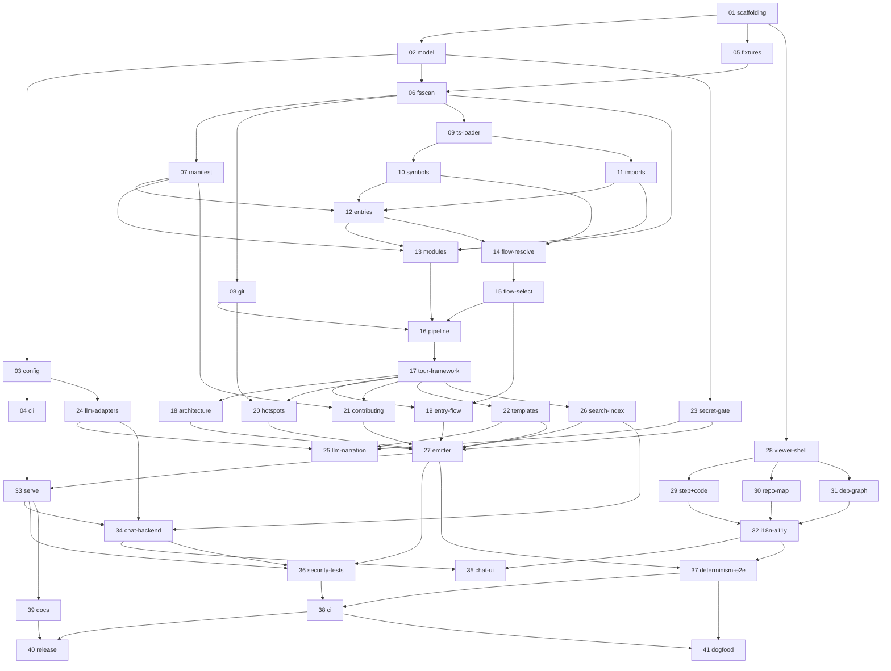

# onboard — v1 Issue Plan

Status: Draft for review (2026-07-10). Derived from [DESIGN.md](./DESIGN.md).
GitHub Issues are generated from `docs/issues/NN-*.md`; this file is the roadmap and the
source of truth for scope, ordering, and dependencies.

## 1. v1 completion statement

> When issues **01–41** are all completed and their Validation sections pass, onboard v1
> is complete as specified in DESIGN.md §1.4: a user can run `npx <pkg> generate` /
> `serve` on a TypeScript/JavaScript repository and receive the four tours
> (architecture, entry-flow, hotspots, contributing) in a self-contained static viewer;
> LLM-off output is byte-identical across runs (CI-enforced); optional LLM narration and
> localhost-only chat work with budgets and token reporting; publishing `site/` to static
> hosting works with chat auto-disabled; the secret gate blocks leaking emits. No product
> behavior exists outside this issue list except items explicitly listed as v2 (§7) or
> known unknowns (§8).

## 2. Issue list (recommended execution order)

| # | File | Title (GitHub) | Wave | Depends on | DESIGN refs |
|---|---|---|---|---|---|
| 01 | `issues/01-repo-scaffolding.md` | Scaffold pnpm workspace, toolchain, and CI skeleton | 0 | — | §2.4, §3, §14.6 |
| 02 | `issues/02-model-schemas.md` | Core data model: zod schemas, stable JSON, ids/hashing | 0 | 01 | §5 |
| 03 | `issues/03-config-loader.md` | Config schema, defaults, loader, and `onboard init` | 0 | 02 | §4.3–4.4 |
| 04 | `issues/04-cli-skeleton.md` | CLI skeleton: commands, exit codes, logging, error taxonomy | 0 | 03 | §4.1–4.2, §12 |
| 05 | `issues/05-test-fixtures.md` | Test fixtures and deterministic fixture-git helper | 0 | 01 | §14.1 |
| 06 | `issues/06-fsscan-analyzer.md` | fs-scan analyzer: listing, exclusions, caps, language map | 1 | 02, 05 | §6.2 |
| 07 | `issues/07-manifest-analyzer.md` | Manifest analyzer: package.json, README, CI workflows | 1 | 06 | §6.3 |
| 08 | `issues/08-git-analyzer.md` | Git history analyzer: activity, co-change, privacy rules | 1 | 06 | §6.4, §11.9 |
| 09 | `issues/09-ts-project-loader.md` | TS project loader with tsconfig discovery and guards | 1 | 06 | §6.6 |
| 10 | `issues/10-symbol-indexer.md` | Exported symbol indexer | 1 | 09 | §6.7 |
| 11 | `issues/11-import-graph.md` | Import graph builder (file-level, resolved) | 1 | 09 | §6.8 |
| 12 | `issues/12-entrypoint-detector.md` | Entry-point detector with evidence scoring | 1 | 07, 10, 11 | §6.9 |
| 13 | `issues/13-module-mapper.md` | Module mapper: folding, roles, metrics | 1 | 06, 07, 11, 12 | §6.5 |
| 14 | `issues/14-callpath-resolution.md` | Call-path tracer (1/2): call resolution engine | 1 | 10, 12 | §6.10 |
| 15 | `issues/15-callpath-selection.md` | Call-path tracer (2/2): significance scoring and path selection | 1 | 14 | §6.10 |
| 16 | `issues/16-pipeline-orchestrator.md` | Analysis pipeline orchestrator, warnings, degradation matrix | 1 | 06–15 | §6.1, §12, §13 |
| 17 | `issues/17-tour-framework.md` | Tour builder framework and shared excerpt service | 2 | 16 | §7.1 |
| 18 | `issues/18-architecture-tour.md` | Architecture tour builder with treemap/dep-graph layouts | 2 | 17 | §7.2, §5.5 |
| 19 | `issues/19-entry-flow-tour.md` | Entry-point flow tour builder | 2 | 15, 17 | §7.3 |
| 20 | `issues/20-hotspots-tour.md` | Hotspots tour builder | 2 | 08, 17 | §7.4 |
| 21 | `issues/21-contributing-tour.md` | Contributing tour builder | 2 | 07, 17 | §7.5 |
| 22 | `issues/22-template-narration.md` | Template narration engine with en/ja string tables | 2 | 17 | §7.6, §8.1 |
| 23 | `issues/23-secret-gate.md` | Secret scanner and fail-closed emit gate | 2 | 02 | §11.4, §6.2(3) |
| 24 | `issues/24-llm-adapters.md` | LLM provider adapters (fetch/SSE) + test mock | 2 | 03 | §10.5, §11.7 |
| 25 | `issues/25-llm-narration.md` | LLM narration enhancer: budgets, cache, fallback, token report | 2 | 22, 23, 24 | §8.2–8.5 |
| 26 | `issues/26-search-index.md` | BM25 search index builder (generate side) | 3 | 17 | §10.4, §5.4 |
| 27 | `issues/27-site-emitter.md` | Site emitter: bundle serialization, highlighting, CSP, inline data | 3 | 18–23, 26 | §9.1, §4.5, §5.6 |
| 28 | `issues/28-viewer-shell.md` | Viewer shell: boot, router, state, tour navigation chrome | 3 | 01 | §9.2–9.3 |
| 29 | `issues/29-viewer-step-code.md` | Viewer step view and code pane | 3 | 28 | §9.3, §11.5 |
| 30 | `issues/30-viewer-repo-map.md` | Viewer repo-map treemap widget | 3 | 28 | §9.3, §5.5 |
| 31 | `issues/31-viewer-dep-graph.md` | Viewer dependency-graph widget | 3 | 28 | §9.3, §5.5 |
| 32 | `issues/32-viewer-i18n-a11y.md` | Viewer i18n (en/ja), theming, accessibility pass | 3 | 29, 30, 31 | §9.4 |
| 33 | `issues/33-serve-static.md` | `onboard serve`: hardened static server and session endpoint | 3 | 04, 27 | §10.1–10.2, §11.6 |
| 34 | `issues/34-chat-backend.md` | Chat backend: retrieval, prompt assembly, SSE streaming, budgets | 3 | 24, 26, 33 | §10.3–10.6 |
| 35 | `issues/35-chat-ui.md` | Chat panel UI with token meter and context chips | 3 | 32, 34 | §10.7, §11.5 |
| 36 | `issues/36-security-tests.md` | Security test suite (hostile fixture, server abuse, key hygiene) | 4 | 27, 33, 34 | §14.5, §11 |
| 37 | `issues/37-determinism-e2e.md` | Determinism gate, golden bundle, self-host E2E, viewer smoke | 4 | 27, 32 | §14.3–14.4, §5.6 |
| 38 | `issues/38-ci-pipeline.md` | Complete CI pipeline with all blocking gates | 4 | 36, 37 | §14.6 |
| 39 | `issues/39-repo-docs.md` | README, SECURITY.md, CONTRIBUTING.md, privacy statement | 4 | 33 | §11.9, research |
| 40 | `issues/40-packaging-release.md` | npm packaging, name decision, provenance release workflow | 4 | 38, 39 | §11.8, ADR-001, KU-1 |
| 41 | `issues/41-dogfood-demo.md` | Dogfood: onboard's own tour + demo on an external OSS repo | 4 | 37, 38 | §1.3, §14.4 |

## 3. Dependency graph

## 4. Implementation waves

| Wave | Issues | Theme | Parallelism notes |
|---|---|---|---|
| 0 | 01–05 | Foundation: workspace, model, config, CLI shell, fixtures | 01 first; then 02→03→04 serial; 05 parallel to 02–04 |
| 1 | 06–16 | Deterministic analysis pipeline | after 06: {07, 08, 09} parallel; {10, 11} parallel; then 12→{13,14}→15→16 |
| 2 | 17–25 | Tours, narration, secret gate, LLM layer | after 17: 18–22 parallel; 23, 24 parallel anytime after wave 0; 25 last |
| 3 | 26–35 | Emission, viewer, serve, chat | viewer track (28–32) parallel to generator track (26, 27); serve/chat (33–35) after both |
| 4 | 36–41 | Hardening, gates, docs, release, dogfood | 36, 37, 39 parallel; then 38 → 40, 41 |

Wave exit criteria: a wave is done when all its issues' Validation sections pass **and**
the repo is green on the CI that exists at that point. Waves may overlap only along the
dependency edges above.

## 5. Coverage: DESIGN.md § → issues

| DESIGN section | Covered by |
|---|---|
| §1 Product definition | plan-wide; measurable claims: 25, 34, 37 |
| §2 System overview | 16 (pipeline), 27 (emit), 33 (serve) |
| §3 Technology stack | 01, 40 |
| §4.1–4.2 CLI commands/exit codes | 04 (generate/serve wiring: 16, 27, 33) |
| §4.3–4.4 Config/env | 03, 24 (key resolution) |
| §4.5 Output layout | 27, 04 (init: 03) |
| §5.1 Ids/hashing/paths | 02 |
| §5.2 RepoModel | 02 (types), 06–16 (producers) |
| §5.3 TourBundle | 02 (types), 17–22 (producers), 27 (serialization) |
| §5.4 ViewerIndex | 02, 26 |
| §5.5 Widgets | 02, 18 (layouts), 30, 31 (render) |
| §5.6 Determinism contract | 02 (stable-json), 27 (emit), 37 (gate) |
| §5.7 Schema versioning | 02, 28 (viewer check) |
| §6.1 Orchestration/degradation | 16 |
| §6.2 fs-scan | 06 |
| §6.3 Manifest | 07 |
| §6.4 Git | 08 |
| §6.5 Modules | 13 |
| §6.6 TS loader | 09 |
| §6.7 Symbols | 10 |
| §6.8 Imports | 11 |
| §6.9 Entry points | 12 |
| §6.10 Call paths | 14, 15 |
| §7.1 Tour framework | 17 |
| §7.2 Architecture tour | 18 |
| §7.3 Entry-flow tour | 19 |
| §7.4 Hotspots tour | 20 |
| §7.5 Contributing tour | 21 |
| §7.6 Narration keys | 22 |
| §8.1 Templates | 22 |
| §8.2–8.5 LLM narration/tokens | 25 (adapters: 24) |
| §9.1 Emitter | 27 |
| §9.2–9.3 Viewer | 28, 29, 30, 31, 35 |
| §9.4 A11y/i18n | 32 |
| §10.1–10.2 Server/session | 33 |
| §10.3–10.4 Chat endpoint/retrieval | 34 (index build: 26) |
| §10.5 Adapters | 24 |
| §10.6 Chat accounting | 34 |
| §10.7 Chat UI | 35 |
| §11.1–11.3 Boundaries/threats/validation | cross-cutting: 06, 16, 27, 33; verified in 36 |
| §11.4 Secret gate | 23 |
| §11.5 XSS contexts | 27, 29, 35; verified in 36 |
| §11.6 Server hardening | 33; verified in 36 |
| §11.7 LLM boundary | 24, 25, 34 |
| §11.8 Supply chain | 38 (audit), 40 (provenance) |
| §11.9 Privacy | 08 (identities), 39 (statement) |
| §12 Errors/logging | 04 |
| §13 Limits | 06, 09, 16 (enforcement points) |
| §14.1 Fixtures | 05 |
| §14.2 Unit tests | every issue's Validation |
| §14.3 Component/E2E | 28–35 (component), 37 (smoke/e2e) |
| §14.4 Determinism/self-host gates | 37 |
| §14.5 Security tests | 36 |
| §14.6 CI | 01 (skeleton), 38 (complete) |
| §15 Scope boundaries | this plan §7–8 |

## 6. Validation strategy (whole product)

1. **Per-issue**: every issue defines runnable Validation commands (unit tests +
   fixture assertions). No issue closes on "looks right".
2. **Wave gates**: wave 1 ends with pipeline snapshot tests on all fixtures; wave 2 ends
   with tour-structure snapshots; wave 3 ends with a served end-to-end session (mock
   LLM); wave 4 is itself the product-level gate set.
3. **Standing CI-blocking gates** (from issue 38 onward): lint + typecheck + unit +
   component + Playwright smoke + **determinism double-run** + **golden bundle** +
   **self-host** + **security suite** + `pnpm audit` (high). Definitions: DESIGN §14.
4. **Manual acceptance** (issue 41): human walkthrough of onboard's own tour and one
   external OSS repo tour; ja locale spot-check by the repo owner (KU-7).

## 7. Deferred to v2 (not in any issue)

Drift detection `onboard check`; CodeTour export; VS Code extension; terminal TUI;
tree-sitter multi-language analysis; comprehension quizzes; browser BYO-key chat;
monorepo per-package tours; incremental regeneration; embeddings retrieval; published
GitHub Action; tour markdown/PDF export. Rationale: DESIGN §15.2.

## 8. Known unknowns (may spawn new issues during implementation)

| ID | Unknown | Likely blast radius |
|---|---|---|
| KU-1 | npm package name (`onboard` taken) | issue 40 only (bin name fixed) |
| KU-2 | TS 7 toolchain friction | issue 01 (fallback `~5.9` documented) |
| KU-3 | ts-morph memory on huge repos | issue 09/16 caps; possible v1.1 process isolation |
| KU-4 | Windows end-to-end behavior | new issues post-v1; normalization rules already in §5.1 |
| KU-5 | Call-path quality on framework-heavy repos | issue 15 heuristics tuning; honest `truncated` flag |
| KU-6 | Shiki v4 dual-theme exact API | issue 27 implementation detail |
| KU-7 | ja narration naturalness | issue 41 manual acceptance |

## 9. Process notes

- GitHub Issues are created from `docs/issues/*.md` **after** those files are reviewed
  (Codex review workflow); the local files remain canonical — edit them first, then sync
  the GitHub issue.
- Each issue is sized for one focused implementation task by a lower-capability agent:
  one module/surface, exact file paths, no cross-issue guessing. When an implementer
  discovers a contradiction with DESIGN.md, the fix is: update DESIGN.md first (PR), then
  the issue.
